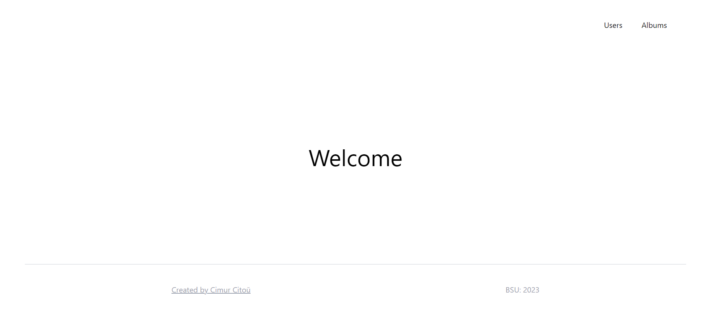
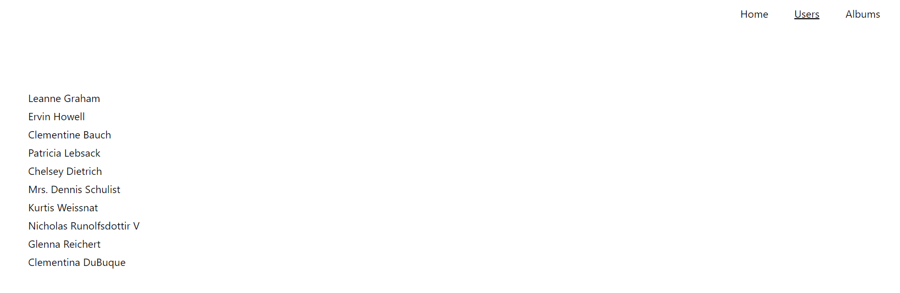
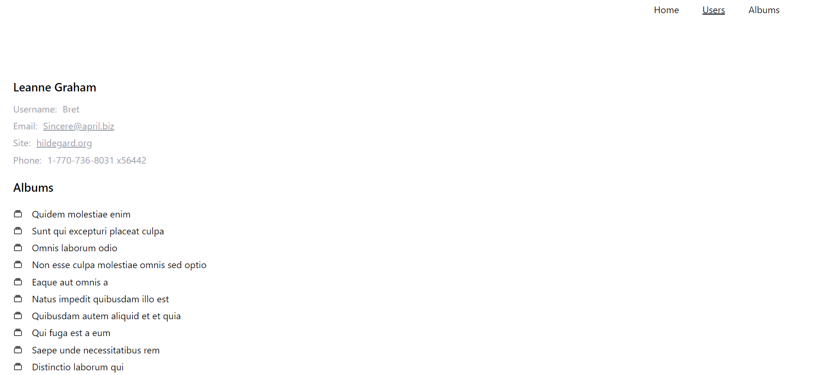
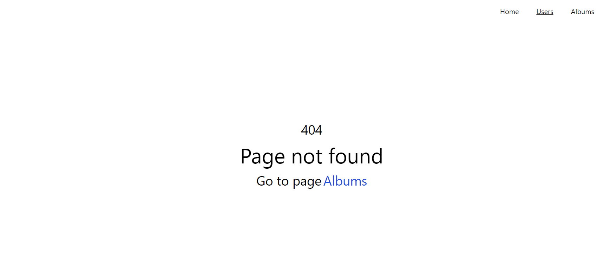
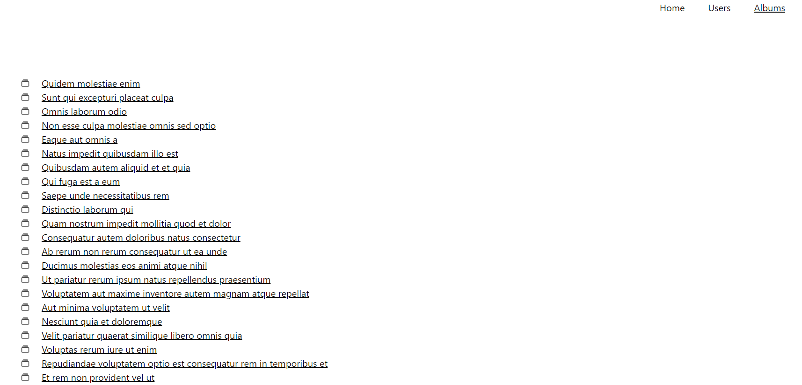
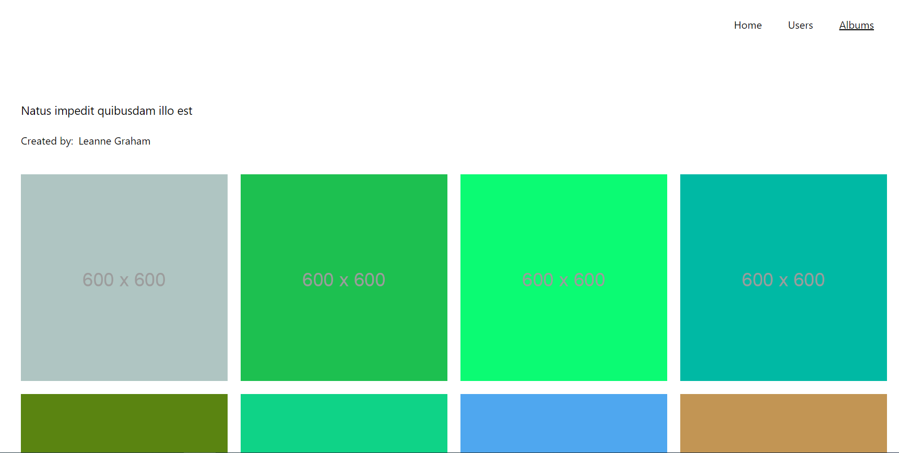

# API SPA

## Introduction
The application provides an intuitive user interface where users can view their albums and browse through the photos within each album. 
### Technologies
- ReactJS
- Tailwind

### There are some screenshots








### Copy application
````commandline
   git clone https://github.com/mrDinosaur410/spa-api-react.git 
````

### Run application
````commandline
   npm install
   npm run start
````
